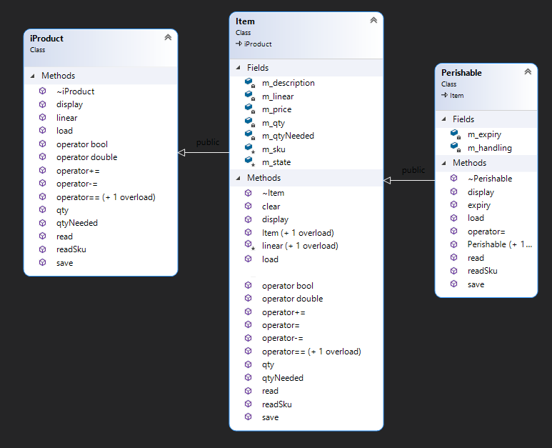

# Project: Disaster and Emergency Aid Management 
## Current project state
V1.0


### Milestones

|Milestone| Revision |  Overview<br />session |Comments |
|------|:---:|:---:|:----|
| [MS1](#milestone-1) | V1.0 | | |
| [MS2](#milestone-2) | V1.0 |  |  |
| [MS3](#milestone-3) | V1.0  |  |  |
| [MS4](#milestone-4) | V1.0  | |  |
| [MS5](#milestone-5) | V1.0 |  | |


## Use case

When disaster hits a nation, the most urgent task is to be able to provide the people affected with what they need as quickly and as efficiently possible.
Your job for this project is to prepare an application that manages the list of items needed to be shipped to the area. The application should be able to keep track of the quantity of each item needed, the number of items on hand, shipping the items and storing the data in a file for future use. 

The types of items needed to be shipped in this situation are divided into two main categories; 

- Non-Perishable products, such as blankets and tents, that have no expiry date. We refer to these types of products as Items.
- Perishable products, such as food and medicine, that have an expiry date. We refer to these products as Perishables. 

To accomplish this task we need to create several classes to encapsulate the problem and provide a solution for this application. 


### Milestones

|Milestone| Revision |Comments |
|------|:---:|:----|
| [MS1](#milestone-1) | V1.0 | |
| [MS2](#milestone-2) | V1.0 | |
| [MS3](#milestone-3) | V1.0 | |
| [MS4](#milestone-4) | V1.0 |  |
| [MS5](#milestone-5) | V1.0 |  |


## Milestones due dates
This project will be done in 5 milestones and each milestone will have its due date. The due date of each milestone is stated below, and it is based on the amount of work to be done for that milestone. 

> If you would like to successfully complete the project and be on time, **start early** and try to meet all the due dates of the milestones.

## Final project mark and due dates

|Milestone| Mark | Due date | Submission Policy|
|:------:|:---:|:---:|-------|
| MS1 | 10% | Nov 4 | gets full mark even if 1 week late. gets 0% afterwards, **Rejected After Dec 02**|
| MS2 | 10% | Nov 8 | gets full mark even if 1 week late. gets 0% afterwards, **Rejected After Dec 02**|
| MS3 | 10% | Nov 19 | gets full mark even if 1 week late. gets 0% afterwards, **Rejected After Dec 02**|
| MS4 | 10% | Nov 22 | gets full mark even if 1 week late. gets 0% afterwards, **Rejected After Dec 02**|
| MS5 | 60% | See below| See below|

### Milestone 5 submissions
- **Due date**: Dec 2
- Project submission **rejection date**: Dec 9
- **Penalty** for late submissions is **10% per day** up to **maximum of 5 days**. (mark of zero after 5 days)

> To make the final submission of the project easier and to make it possible to partially submit a project we have divided the submission of milestone 5 into six small ones. Each submission is worth 10% of the project mark. Your project will be marked only if you have all four milestones and at least have one of the 6 six submissions of milestone 5. 

|Milestone 5<br/> Divided into<br/>Six submission| Description | Comments |
|:------|:---|-------|
| [m51](#milestone-51) | [Menu item 7 and 1](#milestone-51)  | Mandatory, this is needed for the rest<br /> of the options to be functional|
| [m52](#milestone-52) | [Menu item 2](#milestone-52) | Optional with 10% penalty |
| [m53](#milestone-53) | [Menu item 3](#milestone-53) | Optional with 10% penalty |
| [m54](#milestone-54) | [Menu item 4](#milestone-54) | Optional with 10% penalty |
| [m55](#milestone-55) | [Menu item 5](#milestone-55) | Optional with 10% penalty |
| [m56](#milestone-56) | [Menu item 6](#milestone-56) | Optional with 10% penalty |


> The first 4 milestones will not be marked based on the code, but their success and their timely submissions. You may modify or debug your previous code as you are going through the milestones. The only milestone that is going to scrutinized based your code will be milestone 5. If you require any feedback on your first four milestones you need to ask your professor to do so.

***NOTE:***<br/>
**Your project will receive a mark of zero if any of the milestones are not submitted by [the rejection date](#milestone-5-submissions)<br />For your project to be marked, you must submit all the 4 milestones and at least part 1 of the 6 submissions of Milestone 5**

### Checking Due dates using the submitter program


You can check the due date of each milestone using the ```-due``` flag in the submission command:
```bash
~profname.proflastname/submit 2??/prj/m? -due
```
- replace **2??** with the subject code
- replace **m?** with the milestone number

## Citation, Sources

When submitting your work, all the files submitted should carry full student information along with the "citation and sources" information. See the following example:

If you have multiple submissions of the same milestone, please update the Revision History in each submission so your professor knows what changes to look for.

```C++
/* Citation and Sources...
Final Project Milestone ? 
Module: Whatever
Filename: Whatever.cpp
Version 1.0
Author	John Doe
Revision History
-----------------------------------------------------------
Date      Reason
2023/?/?  Preliminary release
2023/?/?  Debugged DMA
-----------------------------------------------------------
I have done all the coding by myself and only copied the code 
that my professor provided to complete my workshops and assignments.
-----------------------------------------------------------
OR
-----------------------------------------------------------
Write exactly which part of the code is given to you as help and 
who gave it to you, or from what source you acquired it.
-----------------------------------------------------------*/
```

**Failing to include the above citation to any of the files containing your work will cause the rejection of your project submission**

## Compiling and Testing Your Program

All your code should be compiled using this command on `matrix`:

```bash
g++ -Wall -std=c++11 -g -o ws file1.cpp file2.cpp ...
```

- `-Wall`: the compiler will report all warnings
- `-std=c++11`: the code will be compiled using the C++11 standard
- `-g`: the executable file will contain debugging symbols, allowing *valgrind* to create better reports
- `-o ws`: the compiled application will be named `ws`

After compiling and testing your code, run your program as follows to check for possible memory leaks (assuming your executable name is `ws`):

```bash
valgrind --show-error-list=yes --leak-check=full --show-leak-kinds=all --track-origins=yes ws
```

- `--show-error-list=yes`: show the list of detected errors
- `--leak-check=full`: check for all types of memory problems
- `--show-leak-kinds=all`: show all types of memory leaks identified (enabled by the previous flag)
- `--track-origins=yes`: tracks the origin of uninitialized values (`g++` must use `-g` flag for compilation, so the information displayed here is meaningful).

To check the output, use a program that can compare text files.  Search online for such a program for your platform, or use *diff* available on `matrix`.

> All the code written in the project must be implemented in the **sdds** namespace.

> Make sure that all the debugging code and debugging comments are removed before submission.

## Project Implementation notes:  *Very Important, read carefully*
- All the code written in this project should be within the namespace sdds.
- You are free and encouraged to add any attributes(member variables), functions and methods (member functions) you find necessary to complete your code. If you are not sure about your strategy for adding functionalities and properties to your classes, ask your professor for advice.  
- If any methods are being added and they are not called outside the scope of the class, make sure they are private.

- Unless you are asked for a specific definition, name the variables, and functions yourself. Use proper names and follow the naming conventions instructed by your professor. Having meaningless and misleading names will attract a penalty.

- When creating methods (member functions) make sure to make them constant if in their logic, they are not modifying their class.

- When passing an object or variable by address or reference, if they are not to be modified, make sure they are passed as constant pointers and references.

- If an Empty state is required for an object, it is considered to be an “invalid” empty state, and objects in this state should be rendered unusable.

- A module called **Utils** is added to the project that can be used for your custom functions and classes in your implementation. Leave this module "as is" if you don't have any custom functionalities. <br />
You can add any custom code of your own to the **Utils** module to be used throughout the project, but make sure not to modify the functionalities already provided in the Utils module for testing and system time retrieval purposes. 

- You may reuse and copy any code your professor provided for your workshops or functions you may have from previous work in this subject or other subjects and place it in the Utils module. 

# The Project


# Milestone 1
Before we start developing the application, we need to have a few classes developed to help us with the dates in the system, handling the state of the object (error handling), Menus and also a mock-up of the user interface of the application. Also, we need to get familiarized with the Utils module.

# The Utils module  
## Utils.h
```C++
namespace sdds {
   // Testing date values for application testing and debugging
   // these values must not change at submission time.
   const int sdds_testYear = 2023;
   const int sdds_testMon = 10;
   const int sdds_testDay = 9;
   class Utils {
      bool m_testMode = false;
   public:
      // this function will be used to get the current system date or the test date if m_testMode is true
      void getSystemDate(int* year = nullptr, int* mon = nullptr, int* day = nullptr);
      // this function will return the number of days in a month based on the year
      // 1<=mon<=12  year: four digit number (example: 2023)
      int daysOfMon(int mon, int year)const;
      // Puts the system date in test mode, where getSystemDate() function will return 2023, 12, 09
      // or whatever the three constant test dates are set to
      void testMode(bool testmode = true);
   };
   extern Utils ut;  // provides global access to the ut instance in the Utils.cpp file
}

```
## Utils.cpp
```C++
#define _CRT_SECURE_NO_WARNINGS
#include <iostream>
#include <ctime>
#include "Utils.h"
using namespace std;
namespace sdds {
   // The ut object of type Utils that is accessible to any file including "Utils.h" to call the Utils
   // methods
   Utils ut;  
   
   void Utils::testMode(bool testmode) {
      m_testMode = testmode;
   }
   void Utils::getSystemDate(int* year, int* mon, int* day) {
      if (m_testMode) {
         if(day) *day = sdds_testDay;
         if(mon) *mon = sdds_testMon;
         if(year) *year = sdds_testYear;
      }
      else {
         time_t t = std::time(NULL);
         tm lt = *localtime(&t);
         if (day) *day = lt.tm_mday;
         if (mon) *mon = lt.tm_mon + 1;
         if (year) *year = lt.tm_year + 1900;
      }
   }
   int Utils::daysOfMon(int month, int year)const {
      int days[] = { 31, 28, 31, 30, 31, 30, 31, 31, 30, 31, 30, 31, -1 };
      int mon = (month >= 1 && month <= 12 ? month : 13)-1;
      return days[mon] + int((mon == 1) * ((year % 4 == 0) && (year % 100 != 0)) || (year % 400 == 0));
   }
}
```
The above Utils module is provided with the application. 
You may add any of your own methods as needed to the Utils class, to be used in the application or add any stand-alone helper functions. (having these functions methods of Utils is preferred)

### Recommended methods for Utils
The following are recommended methods that if you develop, it is going to ease the development of the rest of the project since the tasks these functions provide will be needed several times in the project:

#### void Utils::alocpy(char*& destination, const char* source);
Safely allocates memory in the destination argument and copies the source into it.
- deletes the destination dynamic array and sets it to null
- if the source is not null<br />Allocates memory in the destination to the size of the source and copies the source into it.

#### int Utils::getint(const char* prompt = nullptr)
If the prompt is not null, it will display it. Then it performs a foolproof entry of an integer. If the user enters an invalid integer it will display `"Invalid Integer, retry: "` and will not let the user leave the function until a valid integer is entered.

#### int Utils::getint(int min, int max, const char* prompt=nullptr, const char* errMes=nullptr);
If the prompt is not null it will be displayed before getting a valid integer. (reuse the previous getint()) <br />
If the entered integer is not within the acceptable range (min and max) then an error message is displayed and it will not let the user leave the function until an acceptable value is entered.
When printing the error message, if the errMes argument is not null it will be displayed followed by `", retry: "` otherwise the general error message `"Value out of range [min<=val<=max]: "` is displayed (replacing min and max with their values)


> Note: Implementation of the above functions is optional. You can use your own way to implement the requirements of the application if you like.<br />As we advance through the implementation of the project, more suggestions for Utils function may follow 


## Milestone 1 Overview

### Status Class
A class to keep track of the state of an object by holding the description of the state and an optional status code. 
For example `Error desc: "Invalid Range", Error code: 101 ` 

### Date Class 
A class that encapsulates year, month and day values for date stamping, validation, comparison and date IO purposes. 

## The Status class

This class encapsulates two values:
- A dynamic C-String for the description of the status of an object.
- An integer for an optional status Code.

### Construction
A Status object can be constructed with or without a C-String as a description.
- If the description is provided, a dynamic copy of it will be kept in the class description. 
- If the description is not provided, the class description will be set to null.
- In both cases the Code will be zero.

### Rule of three
A Status object should be safely copied from or assigned to another Status object and when going out of scope there should be no memory leak.

### Assignment operator overloads
A Status object should be able to be assigned to an integer or a C-String. The results of the assignments should set the code or the description dynamically (with no memory leak).

### Type Conversion Overloads
- Casting a Status object to an integer should return the code
- Casting a Status object to a constant character pointer should return the description.
- Casting a Status object to a boolean should return true if the description is null and false if it is not. Which means if the Status has no description, the owner class is in a good (true) state. (No news is good news.)

### The clear() method
Create a method called clear() that safely deallocates the description and sets the code to zero. 
This method will return a reference to the current object at the end. 

### Helper insertion operator overload
Overload the insertion operator to be able to print a Status object using ostream.
This operator overload should print the Status only if it is in a bad (false) state. [See type conversion(bool overload)](#type-conversion-overloads)

When printing the status object the code is printed only if it is not zero as follows `"ERR#???: " where ??? replaced with the code. <br />
Then the description of the Status object is printed.  

## Status Tester program
[StatusTester.cpp](./ms1/StatusTester.cpp)
## Status tester output
```text
Enter following values :
abc
123
-123
12
> abc
Container: (Invalid Integer)
Error #: 0
Problem: Invalid Integer
> 123
Container: (ERR#1: value too high)
Error #: 1
Problem: value too high
> -123
Container: (ERR#-1: value too low)
Error #: -1
Problem: value too low
> 12
Container: (12)
```


## The Date Class

### Constant values
Create a constant value indicating the largest acceptable value for a year and set it to 2030. (referred as the **"maximum year value*** here)

### Attributes
The date class encapsulates the following:
- **Year**; an integer between the current year the maximum year value.
- **Month**; an integer between 1 and 12
- **Day**; an integer between 1 and the number of days in the month based on the year. 
- **State**; a Status object that holds the validity status of date.
- **Formatted**; a boolean value that is set to true to print the date as YYYY/MM/DD or false to print it as YYMMDD.

### Private Methods

#### validate
Does not receive any arguments and returns a boolean.

This function validates the year, month and day, kept in the object in the following order (and validation stops if an invalid value is found):
- If the year value is invalid (less than the current year or more than the maximum year value),  the State is set to `"Invalid year in date"` and then set to the code `1`.
- If the month value is invalid (less than `1`or more than `12`), the State is set to `"Invalid month in date"` and then set to the code `2`.
- If the day value is invalid(less than one or more than the maximum number of days in the month based on the year), the State is set to `"Invalid day in date"` and then set to the code `3`.
- The State is cleared if everything is valid.

In the end, if the date is valid the function returns true or false if any of the validations have failed.

#### unique date value
Create a method to return a unique integer value tied to the date. Use this value to compare two dates.
Use the following formula to obtain the unique integer value:
```text
year * 372 + mon * 31 + day
```

### Construction
A Date is created either with all three values or no value provided.
- If all three values are provided, the year and month and day will be set to the corresponding values and then they are validated.
- If no initial value is provided, the Date is set to the current system date.

### operator overloads for comparison.
Overload all the six comparison operators: `==, !=, <, >, <=, >=`

Use the private method, [unique date value](#unique-date-value) for the comparison.

### state accessor
Create an accessor method called `state` that returns a constant reference to the State of the Date.

### formatted modifier
Create a modifier method called `formatted` to set the Formatted flag (attribute) of the Date.<br />This method should return the reference of the current object.

### bool conversion overload
If the Date object is casted to a boolean, the state of the date object is returned. 


### write method
Create a method called `write` that receives and returns a reference of the ostream object in which it inserts the date value as follows:

- If the Formatted attribute is true, it will print the date in the following format:<br />
`YYYY/MM/DD`, month and day are printed in 2 spaces padded with zero.
- If the Formatted attribute is false it will print the date in the following format:<br />
`YYMMDD`, month and day are printed in 2 spaces padded with zero.

### read method
Create a method called `read` that receives and returns a reference of the istream object from which it extracts the date value as follows:

The date is entered as one integer value. 
- If the value is a four digits integer then the Date is read as: `MMDD` and the year is set to the current system year.
- If the value is a six digits integer then the date is read as: `YYMMDD`.

Then the data is validated and if the validation fails the istream object is set to a fail state. `istream::setstate(ios::badbit);`


Example:<br />
`0221` will be read as Year: 2023, Month: 2, Day: 21<br />`240315` will be read as Year: 2024, Month: 3, Day: 15<br />`190101` will be read as Year: 2019, Month: 1, Day 1, which will be an invalid date.

### Helper insertion and extraction operator overloads
Overload the insertion and extraction operators to write and read a date object through ostream and istream respectively.  (cout and cin)

## Date Tester program:  

[DateTester.cpp](./ms1/DateTester.cpp)

### Date Tester output
> The first line will change base on the date of execution
```text
Current Date: 2023/10/23
Test mode:
Current Date formatted (C): 2023/12/09
Current Date unformatted (C): 231209
Future Date formatted (F): 2024/02/03
Future Date unformatted (F): 240203
The current date is NOT the same as the future date
The current date is the same as the current date
The current date is Less than or equal to the future date
The current date is Less than or equal to the current date
The current date is Less than the future date
The future date is greater than or equal to the current date
The future date is greater than or equal to the future date
The future date is greater than the current date
--------------
Assigning the Current date to the future date!
Now both of the dates are the same!
Enter the following:
1- abc
2- 12
3- 1212
4- 121212
5- 231312
6- 250229
7- 240229
> abc
Invalid date value
> 12
ERR#2: Invalid month in date
> 1212
Date enterd: 2023/12/12
> 121212
ERR#1: Invalid year in date
> 231312
ERR#2: Invalid month in date
> 250229
ERR#3: Invalid day in date
> 240229
Date enterd: 2024/02/29
```


## MS1 Submission 
> If you would like to successfully complete the project and be on time, **start early** and try to meet all the due dates of the milestones.

### MS1 Tester Progtram

[main.cpp](./ms1/main.cpp)

### MS1 Expected Output

[correct_output.txt](./ms1/correct_output.txt)

### Submission

Upload your source code and the tester program to your `matrix` account. Compile and run your code using the `g++` compiler [as shown in the introduction](#compiling-and-testing-your-program) and make sure that everything works properly.

Then, run the following command from your account (replace `profname.proflastname` with your professor’s Seneca userid):
```
~profname.proflastname/submit 2??/prj/m?
```
and follow the instructions.

- *2??* is replaced with your subject code
- *m?* is replaceed with the milestone name (i.e. m1, m2, etc...)

### The submit program's options:
```bash
~prof_name.prof_lastname/submit DeliverableName [-submission options]<ENTER>
[-submission option] acceptable values:
  "-due":
       Shows due dates only
       This option cannot be used in combination with any other option.
  "-skip_spaces":
       Do the submission regardless of incorrect horizontal spacing.
       This option may attract penalty.
  "-skip_blank_lines":
       Do the submission regardless of incorrect vertical spacing.
       This option may attract penalty.
  "-feedback":
       Check the program execution without submission.
```

## [Back to milestones](#milestones)


# Milestone 2
# The User interface
Now that the Status and Date classes are developed we can create the user interface of the system. 
To accomplish this we need to create two classes; `Menu` and `AidMan` (Aid Management)

## The Menu Module.
Create a class called Menu. 
This class has at least one attribute.
- A dynamically allocated text that contains the list of options the user can select from.

>For example, if a menu offers three types of drinks:
>```text
>1- Orange Juice
>2- Water
>3- Apple Juice
>```
>The text that the menu holds will be:
>`"Orange Juice\tWater\tApple Juice"`. <br />
>In this project we will call this text, **the menu content**.<br />
>Also, from the number of tabs in the menu content we can determine that the number of options will be `3` (i.e. 2 tabs separate 3 options).

### Construction
A Menu is created using a C-string.

The maximum number of options is 15, if the number of options is more than 15 or if the C-String is null, then the menu is rendered invalid.

### Rule of three.
- A Menu cannot be copied or assigned to another Menu.
- When going out of scope **the menu content** is deallocated to prevent a memory leak.

### Methods
The menu has only one public method called run().
#### run()
This method receives nothing and returns an unsigned integer and will not change the state of the Menu object.

The run method will first displays **the menu content**  in a menu format, prints a separator line and then prints `"0- Exit"` and finally goes to a new line.
Then it will display `"> "` as a prompt and waits for the user to enter an integer between 0 and the number of options.
This integer entry is foolproof. The user can not exit this stage unless a valid integer number with a valid value is entered. 
- If the user enters a non-integer value the error message should be: `"Invalid Integer, retry: "`. 
- If the user enters an invalid integer then the error message should be: `"Value out of range [0<=val<=X]: "`. Where `X` is the number of options.

In the end, the selected number will be returned.

If the manu is invalid, ```"Invalid Menu!<Newline>"``` is printerd and run() returns 0.

#### Execution sample
Using the previous example's data an execution sample of the run method will be as follows:

```text
1- Orange Juice
2- Water
3- Apple Juice
---------------------------------
0- Exit
> abc<ENTER>
Invalid Integer, retry: 10
Value out of range [0<=val<=3]: 3
```

3 will be returned by the run function.

#### Additional methods
The Menu class with the above capabilities supports what we need from a Menu up to this part of the application. There is no "need" for any additional methods or attributes. However, you are free to (and probably should) add any other functionality or attributes needed to make the work easier for you.  

## The AidMan Module

The AidMan Module is the controller of the whole system. We will design it as if the application is complete but concerning the functionality of the application, it will be completely hollow. Essentially at this stage of the development, AidMan is only a prototype for the system. 

When all the pieces of the system are developed, we will put them together by adding their role to the AidMan Class.

### Development
Create a class called AidMan that offers a Menu with the list of tasks needed to be done to manage the preparation of products to be shipped to places in need. 

#### Attributes

##### file name
Dynamically holding the name of a data file holding the aid and product information.
##### main menu 
A Menu object.  

#### Private Methods
For now, there is only one private method, but as we advance in the development of the system new methods may be added.

##### menu()
This function receives nothing and returns an unsigned integer that is the user's selection of an option in the main menu of the system. The menu function will not change the state of the AidMan class.

The Menu will first print the title of the application, the current date and the data file name.
```text
Aid Management System Prototype
Date: YYYY/MM/DD
Data file:  filename.csv
---------------------------------
```
If the **filename** attribute is null, it will print `"No file"` instead of the file name.

Then it will run the main menu and return the selection made by the user.

#### Construction
The AidMan has only a one-argument constructor that receives a filename  and initializes the main menu with the following text as **the menu content**:
```text
"List Items\tAdd Item\tRemove Item\tUpdate Quantity\tSortShip Items New/Open Aid Database"
```
The filename is copied and dynamically kept in the filename attribute only if it is not nullptr. If it is nullptr then the filename attribute will be nullptr as well. 

#### Rule Of Three
- An AidMan object can neither be copied nor assigned to another AinMan object.
- When going out of scope the destructor makes sure there is no memory leak.

### the public method run()
run() receives and returns nothing and runs the whole application.

In a loop, the run function will keep displaying the menu by calling the **menu()** function and awaits the user's entry. Then after each selection, based on the user's entry, it will execute the task chosen from the menu. 

The run function exits when the user selects `0`, at which point it will print `"Exiting Program!"<NEWLINE>` and terminates.

For now, when a task is selected just print the task name as follows:<br />
`<NEWLINE>****Task Name****<2 NEWLINES>`<br />
for example, print the following if option 4 is selected:
`<NEWLINE>****Update Quantity****<2 NEWLINES>`<br />

## MS2 Submission 
> Make sure that all the debugging code and debugging comments are removed before submission.

### MS2 Tester Progtram

[main.cpp](./ms2/main.cpp)

### MS2 Expected Output

[correct_output.txt](./ms2/correct_output.txt)

### Submission

Upload your source code and the tester program to your `matrix` account. Compile and run your code using the `g++` compiler [as shown in the introduction](#compiling-and-testing-your-program) and make sure that everything works properly.

Then, run the following command from your account (replace `profname.proflastname` with your professor’s Seneca userid):
```
~profname.proflastname/submit 2??/prj/m?
```
and follow the instructions.

- *2??* is replaced with your subject code
- *m?* is replaced with the milestone (i.e. m1, m2, etc)

### The submit program's options:
```bash
~prof_name.prof_lastname/submit DeliverableName [-submission options]<ENTER>
[-submission option] acceptable values:
  "-due":
       Shows due dates only
       This option cannot be used in combination with any other option.
  "-skip_spaces":
       Do the submission regardless of incorrect horizontal spacing.
       This option may attract penalty.
  "-skip_blank_lines":
       Do the submission regardless of incorrect vertical spacing.
       This option may attract penalty.
  "-feedback":
       Check the program execution without submission.
```

## [Back to milestones](#milestones)

# Milestone 3
## Core classes overview
Overall there are going to be 3 core classes in this application:
### iProduct
An interface for an Item in the application
### Item
An Item is a concrete iProduct to keep track of the quantity and on-hand-quantity items to be prepared for shipping
### Perishable
A Pereishabe is a concrete Item that has an expiry date

### Class diagram


## MS3 development
Your task for MS3 is to develop the iProduct and the Item modules.

## The iProduct interface

Create an interface module with the following pure virtual functions:
```C++
// to read the Stock-Keeping Unit from the console before
// main data entry
int readSku(std::istream& istr);
// to reduce the quantity on hand
int operator-=(int qty);
// to increase the quantity on hand
int operator+=(int qty);
// returns the price of the produce
operator double()const;
// returns if the iProduct is in a good state
operator bool()const;
// returns the number of products needed
int qtyNeeded()const;
// returns the quantity on hand
int qty()const;
// determines if the iProduct is displayed in a linear format or 
// descriptive format
void linear(bool isLinear);
// saves the iProduct into a file
std::ofstream& save(std::ofstream& ofstr)const;
// loads an iProduct from a file
std::ifstream& load(std::ifstream& ifstr);
// displays the iProduct on the screen
std::ostream& display(std::ostream& ostr)const;
// reads the iProduct from the console
std::istream& read(std::istream& istr);
// return true if the SKU is a match to the iProduct's SKU
bool operator==(int sku)const;
// returns true if the description is found in the iPorduct's description
bool operator==(const char* description)const;

```

Also, set up the destructor of the iProduct to make sure the dynamic descendants of the iProduct interface will not have a memory leak if or when going out of scope.

### Insertion and extraction operator overloads.
Overload the Insertion and extraction operators for istream and ostream to call the display and the read methods of the iProduct.

## iProductTester

[iPorductTester.cpp](./ms3/iProductTester.cpp)

This tester program should generate the following output with no memory leak:

### iProductTester output
```text
load
save
operator bool
operator double
qtyNeeded
qty
operator==(cosnt char*)
operator==
operator+=
operator-=
readSku
Linear
```

## The Item Module

Derive a concrete class called the *Item* class, from the iProduct class.

### Private Attributes
Add the following private attributes to the Item:
- a double for the price
- an integer for quantity on hand
- an integer for the needed quantity. This integer is the target amount for the item to be acquired.
- a dynamic Cstring (not a C++ string) for the description of the item.
- a boolean flag to dictate to the display function if the next output is going to be linear to descriptive.

### Protected Attributes
Add the following attributes to be accessible to the descendants of the **Item**.
- a Status object to hold the state of the Item object
- an integer value to hold the Stock-Keeping Unit number.

### Protected Method

- create a query called **linear** that returns the linear flag of the **Item**

### Construction
The Item has a default constructor that sets all the attributes to zero, nullptr and false.

#### Rule of three
Rule of three is implemented to make sure there is no memory leak in case of copying, assignment or destruction.

### virtual public query iProduct overrides 
  - the **qtyNeeded** method returns the needed-quantity attribute
  - the **qty** method returns the on-hand quantity attribute
  - the **double conversion operator** overload returns the price
  - the **boolean conversion operator** overload returns the state of the object being good.
  
### virtual public modifier iProduct overrides
  - the operator-= reduces the on-hand quantity by the received value
  - the operator+= increases the on-hand quantity by the received value
  - the linear modifier sets the linear flag attribute to true or false.

### public modifier
  - create a modifier called clear that does not accept any argument and sets the state of the Item object back to good, by resetting the state attribute.

### virtual operator== iProduct overrides
  - the integer comparison returns true if the SKU attribute matches the received value
  - the constant character pointer comparison searches in the description of the Item for the appearance of the received Cstring. If a match was found it returns true. If any of the descriptions (The Items or the received value) are null or the match is not found, it will return false.

### virtual Input/Output method iProduct overrides

#### save
If the state of the Item is good, it will write SKU, description, on-hand quantity, needed quantity and price in tab-separated format. 

> Note that the price should be written with 2 digits after the decimal point.

No new line is added.

If the state is not good, it will do nothing. 

In the end, the reference of the ofstream is returned.

#### load
After deallocating the description:

The tab-separated SKU, description, on-hand quantity, needed quantity and price are read into their corresponding attributes and then a single character is discarded from the file.  

If ifstream is in a bad state after the read the state of the item will be set to `"Input file stream read failed!"`

> Note that the description is dynamically allocated

In the end, the reference of ifstream is returned.

#### display
If the state is bad, the state is printed instead.

If the state is good the following will be done.

##### If in linear format  
SKU, description, on-hand quantity, needed quantity and price are printed in the following format:

```text
##### | AAAAAAAAAAAAAAAAAAAAAAAAAAAAAAAAAAA | #### | #### | ####.## |
Example:
45678 | Sleeping Bags                       |  100 |  200 |   65.66 |
45678 | Sleeping Bags and blankets with pil |  100 |  200 |   65.66 |
```
> Note that if the description is too long only the first 35 characters will be printed

No newline is inserted after.

##### If in descriptive format 

The information is printed in the following format with a newline after.

```text
AMA Item:
SKU: The description is printed fully
Quantity Needed: ###
Quantity Available: ###
Unit Price: $####.##
Needed Purchase Fund: $##.##

Example:  
AMA Item:
45678: Sleeping Bags
Quantity Needed: 200
Quantity Available: 100
Unit Price: $65.66
Needed Purchase Fund: $6566.00
```
> Needed Purchase Fund is the amount of money needed to buy the rest of the needed amount to fulfill the needed quantity

#### readSku and read
Entering the information through the console is done in two stages; readSku and read.

##### readSku
Reads the SKU from the screen with the prompt `"SKU: "`. It makes sure the SKU number begins with digits 4 to 9 and it is 5 digits long.

The entry is full-proof, for example:

```text
SKU: ten<ENTER>
Invalid Integer, retry: 12345<ENTER>
Value out of range [40000<=val<=99999]: 45678<ENTER>
```

##### read
After deleting the description and clearing the state.

**read** will first prompt the user with the title "AMA Item" and then displays the SKU and reads the rest of the information in a foolproof way (the same as SKU).

Example:

```text
AMA Item:
SKU: 44444
Description: Sleeping Bag<ENTER>
Quantity Needed: 200<ENTER>
Quantity On Hand: 100<ENTER>
Unit Price: $65.66<ENTER>
```

Valid values are as follows:
- Description: Unknown length of characters
- Quantity Needed: integers between 1 and 9999
- Quantity On Hand: integers between 0 and the needed quantity.
- Price: double values between 0.0 and 9999.0 Dollars.

If the istream fails during reading, the state is set to `"Console entry failed!"`

The istream reference is returned in the end.

## MS3 Submission 

> Make sure that all the debugging code and debugging comments are removed before submission.

### MS3 Tester Progtram

[main.cpp](./ms3/main.cpp)

### MS3 Expected Output

[correct_output.txt](./ms3/correct_output.txt)

### Submission

Upload your source code and the tester program to your `matrix` account. Compile and run your code using the `g++` compiler [as shown in the introduction](#compiling-and-testing-your-program) and make sure that everything works properly.

Then, run the following command from your account (replace `profname.proflastname` with your professor’s Seneca userid):
```
~profname.proflastname/submit 2??/prj/m?
```
and follow the instructions.

- *2??* is replaced with your subject code
- *m?* is replaced with the milestone (i.e. m1, m2, etc)

### The submit program's options:
```bash
~prof_name.prof_lastname/submit DeliverableName [-submission options]<ENTER>
[-submission option] acceptable values:
  "-due":
       Shows due dates only
       This option cannot be used in combination with any other option.
  "-skip_spaces":
       Do the submission regardless of incorrect horizontal spacing.
       This option may attract penalty.
  "-skip_blank_lines":
       Do the submission regardless of incorrect vertical spacing.
       This option may attract penalty.
  "-feedback":
       Check the program execution without submission.
```

## [Back to milestones](#milestones)

# Milestone 4

## The Perishable Class
Inherit a class from the Item class called Perishable. 

A Perishable item, unlike an Item, has an SKU that starts with digits 1 to 3.  (10000 to 39999)

### Attributes
#### The Expiry Date
The Perishable class adds an expiry date to the Item.

#### The Handling Instructions
Dynamically holds a text for the instructions with which the perishable item should be handled.

### Construction
A Perishable object is created using the default constructor that creates an empty perishable item.

### Rule of three
Implement the rule of three so a Perishable Item can be copied or assigned to another perishable item safely.

### Query 
Create a constant query called `expiry` that returns a constant reference of the expiry date.

### Virtual overrides
#### readSKU override
Override readSKU function to only receive SKU numbers between 10000 and 39999 (only SKUs starting with digits 1 to 3)

#### save override
If the Perishable item is in a good state
- it will call the save of the Base class.
- writes a tab
- writes the handling instructions, if handling instructions exist and the attribute is not empty.
- writes a tab
- writes an unformatted copy of the expiry date

#### load override
- calls the load of the Base class.
- reads the handling instructions dynamically into the handling instructions attribute
- ignores the tab
- reads the expiry date
- ignores the new line.
- if the ifstream object has failed, it will set the state of the Item to `"Input file stream read (perishable) failed!"`

#### display override
- if the Perishable Item is in a bad state, the state is printed
- otherwise if linear
   - the display of the base class is called
   - if handling instructions are not null and not empty a single asterisk ('*') is printed otherwise a single space (' ') is printed.
   - the expiry date is printed
- if not linear
   - prints `"Perishable "`
   - displays the base class
   - prints `"Expiry date: "` 
   - printed the expiry date (formatted)
   - if the handling instructions attribute is not null and is not empty `"Handling Instructions: "` and the content of the instructions are printed
   - A new line is printed.
   
##### Examples
###### Linear without handling instructions
```text
 12345 | Baby Formula                        |  140 |  200 |   33.99 | 2023/12/12
```

###### Linear with handling instructions
```text
 12113 | Hydrogen peroxide 100ml bottles     |  275 |  300 |    3.99 |*2024/11/11
```

###### detailed without handling instructions
```text
Perishable AMA Item:
12345: Baby Formula
Quantity Needed: 200
Quantity Available: 140
Unit Price: $33.99
Needed Purchase Fund: $2039.40
Expiry date: 2024/12/12

```

###### detailed with handling instructions
```text
Perishable AMA Item:
12113: Hydrogen peroxide 100ml bottles
Quantity Needed: 300
Quantity Available: 275
Unit Price: $3.99
Needed Purchase Fund: $99.75
Expiry date: 2024/11/11
Handling Instructions: Keep away from direct sunlight

```

#### read override
- The read of the base class is called
- the handling instructions memory is deleted and the attribute is set to null
- prompts: `"Expiry date (YYMMDD): "`
- the expiry date is read
- newline is ignored
- prompts: `"Handling Instructions, ENTER to skip: "`
- peeks and if the very first character is not `'\n'` it will read the instructions dynamically into the instructions attribute. otherwise, nothing is read and the attribute remains null.
- if the istream object is in a fail state, it will set the state of the Perishable Item to `"Perishable console date entry failed!"`.


## MS4 Submission 

### Files to submit
```text
Utils.cpp
Utils.h
Status.cpp
Status.h
iProduct.h
iProduct.cpp
Item.h
Item.cpp
Perishable.cpp
Perishable.h
Date.cpp
Date.h
main.cpp
```

### MS4 Tester Progtram

[main.cpp](./ms4/main.cpp)

### MS1 Expected Output

[correct_output.txt](./ms4/correct_output.txt)

### Submission

Upload your source code and the tester program to your `matrix` account. Compile and run your code using the `g++` compiler [as shown in the introduction](#compiling-and-testing-your-program) and make sure that everything works properly.

Then, run the following command from your account (replace `profname.proflastname` with your professor’s Seneca userid):
```
~profname.proflastname/submit 2??/prj/m?
```
and follow the instructions.

- *2??* is replaced with your subject code
- *m?* is replaceed with the milestone name (i.e. m1, m2, etc...)

### The submit program's options:
```bash
~prof_name.prof_lastname/submit DeliverableName [-submission options]<ENTER>
[-submission option] acceptable values:
  "-due":
       Shows due dates only
       This option cannot be used in combination with any other option.
  "-skip_spaces":
       Do the submission regardless of incorrect horizontal spacing.
       This option may attract penalty.
  "-skip_blank_lines":
       Do the submission regardless of incorrect vertical spacing.
       This option may attract penalty.
  "-feedback":
       Check the program execution without submission.
```


## [Back to milestones](#milestones)

# Milestone 5 (in FP folder)

For the last milestone of this project, complete the implementation of the **AidMan* module (done in milestone 5) and implement the functionalities of the main menu.

To make the testing and submission of the project easier the submission of milestone 5 is broken down into 6 parts; (m51, m52, m53, m54, m55 and m56):

## AidMan maximum number if items.
have the following constant created for maximum number items in the system.
```C++
   const int sdds_max_num_items = 100;
```

## AidMan additional attributes 
Start by adding the following attributes to the AidMan class:
- an array of **sdds_max_num_items** **iProduct Pointers**
- an integer to keep track of the **number of iProduct Items** pointed by the iProduct pointers.<br />Obviously this number can not grow more than 100. 

>This application can only keep track of a maximum of **sdds_max_num_items** products at a time. If more products are being managed, they must be added to a separate data file.
 

## AidMain::run() 

### The main menu 
Modify the run() function so if any menu is selected before opening a database, the selection is changed to 7 automatically.

Insert the following logic after where the main menu selection is returned and before executing the user's selection.

- after getting the selection for the menu. 
- if selection is not zero and the **filename** is null and the selection is not 7, change the selection to 7.

Execution sample:

```text
Aid Management System Version 0.6
Date: 2022/03/31
Data file: No file
---------------------------------
1- List Items
2- Add Item
3- Remove Item
4- Update Quantity
5- Sort
6- Ship Items
7- New/Open Aid Database
---------------------------------
0- Exit
> 1

****New/Open Aid Database****
Enter file name:
```
> note that even though option 1 is selected since there is no data file, selection number 7 is executed.

### saving at exit.

When exiting the run() method, [save](#the-save-method)() the data file.

## Milestone 51
To use the Aid Management application the first action should be selecting menu item 7 to select a data file to work with. If the data file already exists all the records of the data file will be loaded into the iProduct array. If the data file does not exist, then a new data file can be created.

### Menu item 7 (New/Open Aid Database)
Three private methods need to be implemented to complete menu item 7: 
- a method for saving data records in file
- a method to dallocate all the memory allocated by the class
- a method to load all the records from the data file into the class.

#### the save method
- if the filename attribute is not null
   - Creates an ofstream object using the filename (to write into) 
   - then function goes through the **iProduct Pointers** up to the number of **number of iProduct Items** and calls the save() of each iProduct to write them in the file.
- if the filename attribute is null, this function does nothing.

#### the deallocate method
deletes all the dynamic memory allocated in **iProduct Pointers** elements and the filename, and then sets **number of iProduct Items** to zero.

#### the load method. (menu item 7)
Loads data records from a data file and returns true if at least one record is loaded.

- Saves all the already existing iProducts
- Deallocates all the resources of the AidMan class making it ready to load new information.
- opens m_filename for reading in an **ifstream**
- if opening the file was not successful
  - prints: `Failed to open FN for reading!` (where FN is the file name)
  - prints: `Would you like to create a new data file?` and displays the following menu:
  
     ```text
     1- Yes!
     0- Exit
     >
     ```
   
     If the user selects yes, it will create an empty file under the same name and in any case, the function exits after.
- if the file opening the file was successful, in a loop:
   - peeks the first character of the record to determine if the record is a Perishable item or not. (using the first digit of the SKU)
      - if the upcoming record is perishable it will create a new **Perishable** item in the next available **iProduct Pointers** element.
      - if the upcoming record is non-perishable it will create an **Item** in the next available **iProduct Pointers**.
      - if the next character is not recognized as a valid digit, the ifstream is set into an invalid state.
   - if the allocation was a success (Item or Perishable) 
      - calls the load method of the item to load the data from the file. 
      - the loaded item is checked to be in a good state, if true, **number of iProduct Items** is added by one, if false the loaded item is deleted.

## Menu Item 1 (List Items)
Implement a list method for this menu selection (see the following instructions).

When menu item 1 is selected call the [list](#int-listconst-char-sub_desc--nullptr) function and if any items are listed (list is not empty) print the following prompt:  
```text
Enter row number to display details or <ENTER> to continue:
>
```
If the user presses enter, go back to the main menu otherwise display the selected item in a non-linear format.(The integer entry for the row number must be fool-proof.)

### `int list(const char* sub_desc = nullptr);`
- if sub_desc is null, print all the items in a linear format.
- if sub_desc is not, null print only the items containing the sub_desc in their description.
- list returns the number of iProducts printed (in the following example it will return 7)
- if no items are listed, print `"The list is emtpy!"` and go to new line.

Use the following format for your printout:
```text
 ROW |  SKU  | Description                         | Have | Need |  Price  | Expiry
-----+-------+-------------------------------------+------+------+---------+-----------
   1 | 99999 | Description goes here               | 9999 | 9999 | 9999.99 |*2023/11/11
   2 | 19999 | Description goes here               | 9999 | 9999 | 9999.99 |
   3 | 99999 | Description goes here               | 9999 | 9999 | 9999.99 | 2023/11/11
   4 | 29999 | Description goes here               | 9999 | 9999 | 9999.99 |
   5 | 99999 | Description goes here               | 9999 | 9999 | 9999.99 |*2023/11/11
   6 | 39999 | Description goes here               | 9999 | 9999 | 9999.99 |
   7 | 99999 | Description goes here               | 9999 | 9999 | 9999.99 |*2023/11/11
-----+-------+-------------------------------------+------+------+---------+-----------
```
  
### [Tester Programs ](#m51) - [Submission Instructions](#project-submission-ms5)

## Milestone 52
### `int search(int sku) const `
Loops through all the **iProduct Pointers** elements and if the SKU is a match it will return the index, otherwise it will return -1

### Menu Item 2 (Add Item)

- if **number of iProduct Items** is not less than **sdds_max_num_items**, it will print: `"Database full!"`
- Otherwise, the following menu is displayed for the type of the iProduct to be added:

```text
1- Perishable
2- Non-Perishable
-----------------
0- Exit
>
```

- Based on the user's entry a Perishable or Non-Perishable Item is allocated in an iProduct pointer. If the user chooses to exit, the message `"Aborted\n"` is printed. 
- If the user chooses not to exit the SKU of the item is read from the console and [searched](#int-searchint-sku-const) against already existing Items in the system.
- If the SKU is found in the system the message: <br />`"Sku: 99999 is already in the system, try updating quantity instead.\n"` (99999 is replaced with the sku number) is printed and the allocated item is deleted.
- If the SKU is not found, the rest of the data is read from the console. 
- If the read iProduct is in a good state, it is added to the next available element of the **iProduct Pointers** array and **number of iProduct Items** is added by one, otherwise, the allocated Item is displayed and then deleted.

### [Tester Programs ](#m52) - [Submission Instructions](#project-submission-ms5)

## Milestone 53
### `void remove(int index)`
- deletes the iProduct at index in **iProduct Pointers**.
- Then shifts all the iProducts to left once and reduces **number of iProduct Items** by one.

[Illustration](images/remove.pdf)

### Remove Item
- Prompts the user: `"Item description: "`
- Gets a Cstring for a description and [lists the items containing the description](#int-listconst-char-sub_desc--nullptr). 
- If any item was found and listed it will ask for one of the SKU numbers listed to remove. (fool-proof using the prompt ` "Enter SKU: "`)
- [Searches](#int-searchint-sku-const) for the SKU, if not found, it will print `"SKU not found!"`.
- If SKU is found it will print the Item and the following confirmation message and menu:  

   ```text
   Following item will be removed:
   ??? AMA Item:
   99999: Description goes here
   Quantity Needed: 999
   Quantity Available: 999
   Unit Price: $99.99
   Needed Purchase Fund: $0.00
   
   Are you sure?
   1- Yes!
   0- Exit
   >
   ```
   If the user selects yes, it will [remove](#remove-item) and prints `"Item removed!"`. Otherwise, it will exit the menu item printing: `"Aborted!"`

### [Tester Programs ](#m53) - [Submission Instructions](#project-submission-ms5)


## Milestone 54
### Update Quantity
- Prompts `"Item description: "` and receives a sub-description from the user dynamically.
- Lists all the iProducts containing the description; if no match is found, it prints `"No matches found!\n"`
- After displaying all the matches it asks the user for the SKU of the iProduct that needs updating by prompting `"Enter SKU: "`
- Then it will [search for the SKU](#int-searchint-sku-const) to find the index of the iProcuct in the **iProduct Pointers**. 
- If a match is not found it will print `"SKU not found!\n"` and exits
- After finding a match it will display a menu for adding or reducing the quantity:
  ```text
  1- Add
  2- Reduce
  0- Exit
  >
  ```
  if the user selects exit it will print `"Aborted!\n"` and exit.
- If add is selected a fool-proof quantity value is received from 1 up to the maximum amount needed to fulfill the needed quantity using the prompt: `"Quantity to add: "`. Then the quantity is increased by the entered amount.<br />
After increasing quantity, a confirmation message is printed as follows:<br />`"X items added!"`, replacing X with the amount.
- If reduce is selected a fool-proof quantity value is received from 1 up to the quantity on hand using the prompt: `"Quantity to Reduce: "`. Then the quantity is reduced by the entered amount.<br />
After reducing quantity a confirmation message is printed as follows:<br />`"X items removed!"`, replacing X with the amount.
- Selecting Add on an already fulfilled needed quantity should result in issuing the message: `"Quantity Needed already fulfilled!\n"`
- Selecting Reduce on a zero quantity should result in issuing the message: `"Quaintity on hand is zero!\n"`

### [Tester Programs ](#m54) - [Submission Instructions](#project-submission-ms5)

## Milestone 55
### Sort
Sorts the items in the **iProduct Pointers** array, based on difference between quantity needed and quantity on hand in descending order. When completed it will print `"Sort completed!\n"`

### [Tester Programs ](#m55) - [Submission Instructions](#project-submission-ms5)


## Milestone 56

### Ship Items

- Create an ofstream for shipping-order-file under the name `"shippingOrder.txt"`.
- Print in the file: `"Shipping Order, Date: 9999/99/99\n"` (9999/99/99 is replaced by the current date)
- Print the table titles as follows:  
  ```text
   ROW |  SKU  | Description                         | Have | Need |  Price  | Expiry
  -----+-------+-------------------------------------+------+------+---------+-----------
  ```
- In a loop go through all the **iProduct Pointers** elements and if the quantity needed and quantity on hand of the product is a match print it in the linear format into the file and remove it from the  **iProduct Pointers** array.
- Count the number of printed (shipped) items
- At end close the table by printing:  
  ```text
  -----+-------+-------------------------------------+------+------+---------+-----------
  ```
- end the process by printing the number of items shipped on the screen:<br />
`""Shipping Order for 999 times saved!""` , 999 is replaced by the number of shipped (removed) items.


### [Tester Programs ](#m56) - [Submission Instructions](#project-submission-ms5)


# Reflection 

Create a file call `reflect.txt`.

Add all your citations (coding help received or coding help offered to other students)

Write about your final solution for the **project** and the OOP244 subject overall, what you learned and mention any issues that caused you difficulty.

[Reflection Submission](#refection-submission)

# Milestone 5 Testers


### M51

[Back to Milestone 5-1](#milestone-51)

#### Tester program

[main51.cpp](./FP/main51.cpp)

#### Test Data
`<E> = <ENTER>`

```text
1<E>
data.dat<E>
1<E>
<E>
1<E>
5<E>
0<E>
```
#### Expected Output

[correct_output51](./FP/correct_output51.txt)

### M52

[Back to Milestone 5-2](#milestone-52)

#### Tester program

[main52.cpp](./FP/main52.cpp)

#### Test Data
`<E> = <ENTER>`

```text
2<E>
data.dat<E>
2<E>
1<E>
22222<E>
Rice<E>
200<E>
100<E>
16.99<E>
241010<E>
<E>
2<E>
2<E>
44444<E>
0<E>
```
#### Expected Output

[correct_output52](./FP/correct_output52.txt)

### M53

[Back to Milestone 5-3](#milestone-53)

#### Tester program

[main53.cpp](./FP/main53.cpp)

#### Test Data
`<E> = <ENTER>`

```text
3<E>
data.dat<E>
3<E>
en<E>
12113<E>
1<E>
1<E>
<E>
0<E>
```
#### Expected Output

[correct_output53](./FP/correct_output53.txt)

### M54

[Back to Milestone 5-4](#milestone-54)

#### Tester program

[main54.cpp](./FP/main54.cpp)

#### Test Data
`<E> = <ENTER>`

```text
4<E>
data.dat<E>
4<E>
En<E>
11223<E>
0<E>
4<E>
En<E>
11223<E>
1<E>
4<E>
En<E>
11223<E>
2<E>
40<E>
38<E>
4<E>
En<E>
11223<E>
1<E>
40<E>
4<E>
1<E>
<E>
0<E>
```
#### Expected Output

[correct_output54](./FP/correct_output54.txt)

### M55

[Back to Milestone 5-5](#milestone-55)

#### Tester program

[main55.cpp](./FP/main55.cpp)

#### Test Data
`<E> = <ENTER>`

```text
1<E>
data.dat<E>
1<E>
<E>
5<E>
1<E>
<E>
0<E>
```
#### Expected Output

[correct_output55](./FP/correct_output55.txt)

### M56

[Back to Milestone 5-6](#milestone-56)

#### Tester program

[main56.cpp](./FP/main56.cpp)

#### Test Data
`<E> = <ENTER>`

```text
7<E>
data.dat<E>
6<E>
1<E>
<E>
0<E>
```
#### Expected Output

[correct_output56](./FP/correct_output56.txt)


## Project submission (MS5)

### Files to submit
```text
AidMan.h
AidMan.cpp
Date.h
Date.cpp
iPorduct.h
iPorduct.cpp
Item.h
Item.cpp
Menu.h
Menu.cpp
Perishable.h
Perishable.cpp
Status.h
Status.cpp
Utils.h
Utils.cpp
main.cpp
reflect.txt (reflection submission only)
```

Upload your source codes and the tester program to your `matrix` account. Compile and run your code using the `g++` compiler [as shown in the introduction](#compiling-and-testing-your-program) and make sure that everything works properly.

Then, run the following command from your account (replace `profname.proflastname` with your professor’s Seneca userid):
```
~profname.proflastname/submit 2??/prj/m5X
```
and follow the instructions.

- *2??* is replaced with your subject code
- *X* is replaced with part number of milestone 5

### Refection submission

To submit you reflection on the project and the semester overall, please upload `reflect.txt` to matrix.

Then, run the following command from your account (replace `profname.proflastname` with your professor’s Seneca userid):
```
~profname.proflastname/submit 2??/prj/ref
```
and follow the instructions.

### The submitter program's options:
```bash
~prof_name.prof_lastname/submit DeliverableName [-submission options]<ENTER>
[-submission option] acceptable values:
  "-due":
       Shows due dates only
       This option cannot be used in combination with any other option.
  "-skip_spaces":
       Do the submission regardless of incorrect horizontal spacing.
       This option may attract penalty.
  "-skip_blank_lines":
       Do the submission regardless of incorrect vertical spacing.
       This option may attract penalty.
  "-feedback":
       Check the program execution without submission.
```

